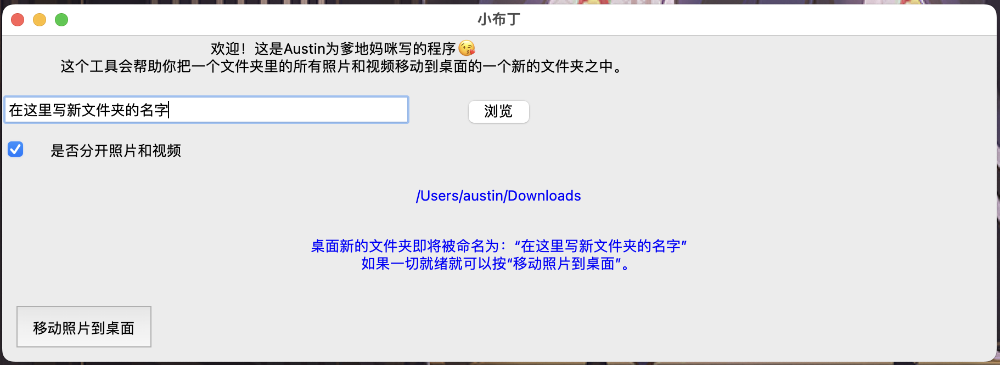

# pudding
A tool created for my parents to move all photos and videos in found in a folder to another folder.

### Preview

### How to Use
1. Input the name of the new folder
2. Click 浏览(browse) to select the folder location of the photos and videos you wish to put into a new folder
3. Use to checkbox to indicate whether you would like separate subfolders for photos and videos (是否分开照片和视频)
4. You will see two sections of text in blue, the first indicates the path selected in step 2, the second is informative
5. If everything looks fine, click 移动照片到桌面(move photos to desktop)
